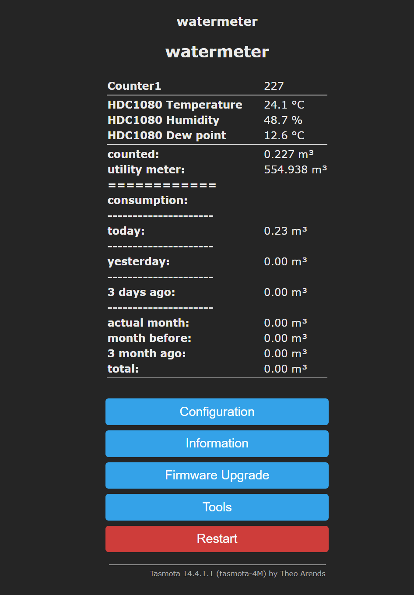
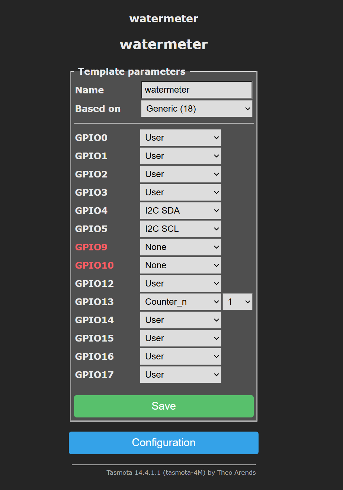

# tasmota-watermeterkit
an alternative firmware for the water meter from watermeterkit.nl based on tasmota

watermeterkit.nl is an OOTB and stable water meter, but it is linked to Homeassist's native API.  
With these files you can create a customer Tasmota firmware,  you can make use of MQTT, and use the water meter without the boundaries of home assists

## Result

## Compile
create a custom firmware with the following files in platform.io with the latest tasmota firmware sources.
### user_config_override.h
find a user_config_override.h with all the needed switches

### watermeter.tas
find the script for the watermeter, and feel free to customize and translate

### template for the board
{"NAME":"watermeter","GPIO":[1,1,1,1,1,1,0,0,1,1,1,1,1,1],"FLAG":0,"BASE":18}

### settings

### credits
kudos to [Thomas Gorjup](https://wiki.gorjup.de/doku.php?id=public:gaszaehler)  for inspiring
